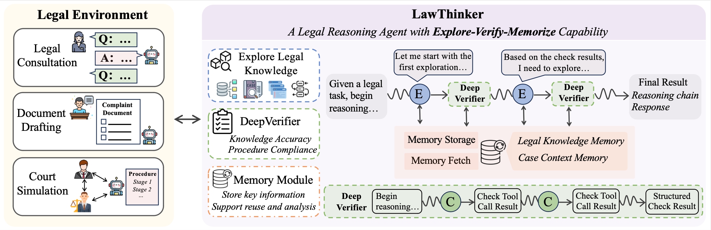
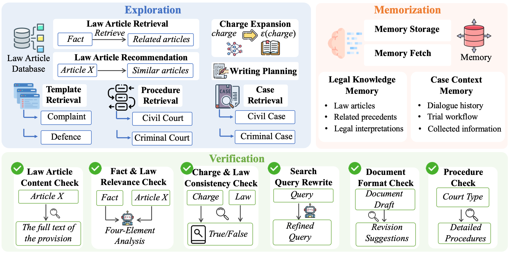

<h1 align="center"> ✨LawThinker: A Deep Research Legal Agent</br> in Dynamic Environments</a></h1>

[](https://arxiv.org/abs/2602.12056)
[](https://opensource.org/licenses/MIT)
[](https://www.python.org/downloads/release/python-3100/)

<h5 align="center"> If you like our project, please give us a star ⭐ on GitHub for the latest update.</h5>

## 💡 Overview
Legal reasoning requires not only correct outcomes but also procedurally compliant reasoning processes. However, existing methods lack mechanisms to verify intermediate reasoning steps, allowing errors such as inapplicable statute citations to propagate undetected through the reasoning chain. To address this, we propose **LawThinker**, an autonomous legal research agent that adopts an Explore-Verify-Memorize strategy for dynamic judicial environments. The core idea is to enforce verification as an atomic operation after every knowledge exploration step. A DeepVerifier module examines each retrieval result along three dimensions of knowledge accuracy, fact-law relevance, and procedural compliance, with a memory module for cross-round knowledge reuse in long-horizon tasks. Experiments on the dynamic benchmark J1-EVAL show that LawThinker achieves a 24\% improvement over direct reasoning and an 11\% gain over workflow-based methods, with particularly strong improvements on process-oriented metrics. Evaluations on three static benchmarks further confirm its generalization capability.

## 🧩 Method
We propose **LawThinker**, an autonomous legal research agent designed for dynamic judicial environments. LawThinker adopts an **Explore-Verify-Memorize** strategy that integrates iterative knowledge exploration with explicit verification throughout the reasoning process. When encountering knowledge gaps, the agent autonomously retrieves relevant legal provisions, cases, and procedural rules from external knowledge bases. Each retrieval is immediately followed by a **DeepVerifier** module, which examines the accuracy of the retrieved content, its relevance to the case facts, and whether its use conforms to legal procedures. The structured verification results are fed back into the reasoning chain, allowing the agent to correct errors before they propagate to subsequent steps. To support long-horizon interactive tasks, a memory module persistently stores validated legal knowledge and key case context, enabling the agent to reuse verified information across multiple reasoning turns. 
  
<p align="center">
  
</p>

## 🧩 Tools
We design 15 legal tools spanning exploration, verification, and memorization, enabling the agent to navigate the legal knowledge space, validate intermediate reasoning steps, and reuse verified information across long-horizon tasks.

<p align="center">
  
</p>

## 🔧 Installation
### Environment Setup
```bash
# Create conda environment
conda create -n j1 python=3.10
conda activate j1

# Install requirements
cd LawThinker
pip install -r requirements.txt
```
## 🏃 Quick Start

### Data Preparation

- **dynamic scenario:**  
  [J1-EVAL](https://huggingface.co/datasets/CimoInkPool/J1-Eval_Dataset)

### Model Inference
```bash
bash src/run_J1-ENVS.sh
```

### Evaluation
```bash
python src/run_J1-Eval.sh
```

## 📄 License

This project is released under the [MIT License](LICENSE).


